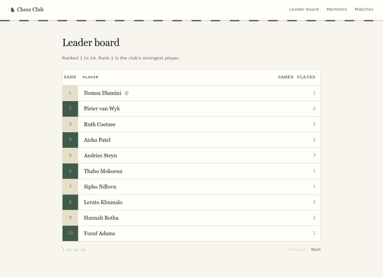
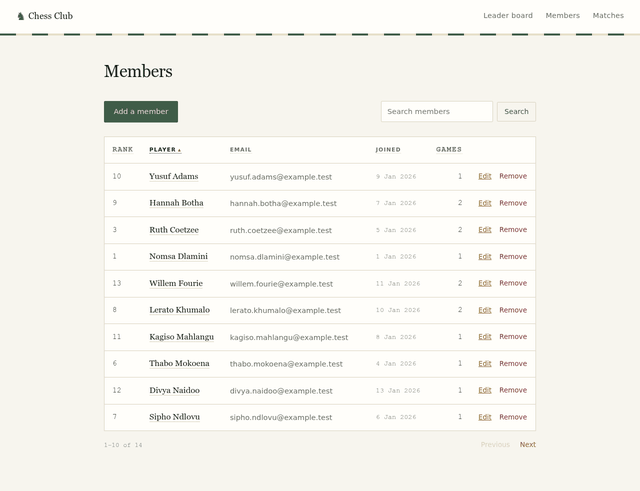
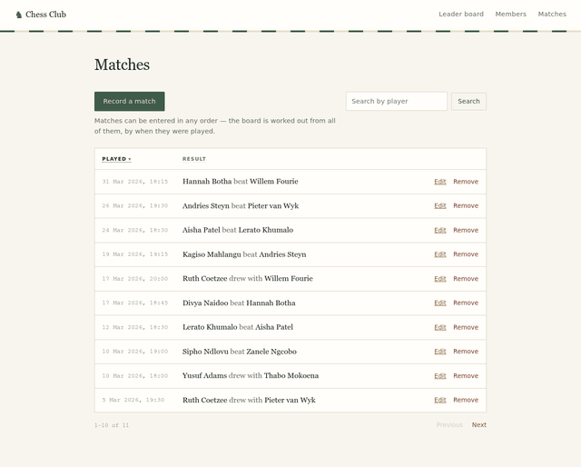
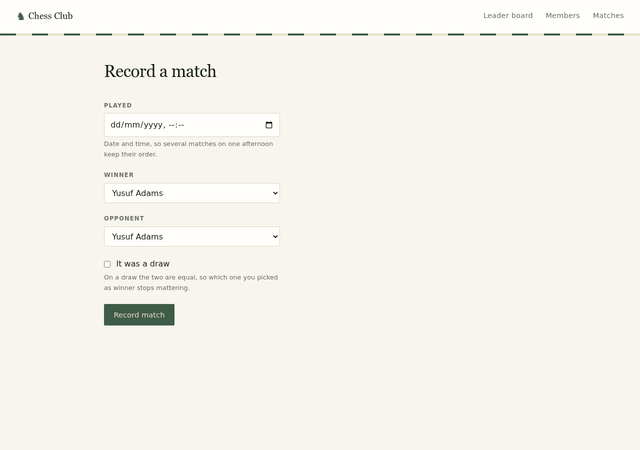

# Chess Club Administration

A small Rails application for ranking people `1..n` by the contests they play
against each other, where 1 is the strongest.

Contests are entered out of the order they were played, and the ranking rules
depend on that order — so no position is ever stored and moved. The contests are
the record, and the standings are recalculated from all of them after every
change. That is what lets a mistyped contest be corrected: everything that
followed from it is worked out again.

The code does not use the vocabulary of the game. A person is a `Person`, a match
is a `Contest`, a draw is a tie, and the ranked list is the standings — see
[`docs/decisions/plain-words-in-code.md`](docs/decisions/plain-words-in-code.md)
for why, and the spec below for the mapping in full.

## The screens

**Leader board** — the ranking, 1 to n, in board order. It is the one grid with
no sortable column: the order is the point.



**Members** — create, show, update and delete, with each person's current rank
read from the standings. Every column sorts, both ways, and the search survives
a re-sort.



**Matches** — every contest played, newest first. Entered in any order; the
board is worked out from all of them by when they were played.



**Recording a match** — two players and a winner, or a draw.



## Documentation

| If you want | Read |
|---|---|
| How the code is built | [`docs/principles.md`](docs/principles.md) |
| The rules it must obey, and their guards | [`docs/constitution.md`](docs/constitution.md) |
| Why a specific decision was made | [`docs/decisions/`](docs/decisions/) |
| What this application stores and derives | [`docs/specs/2026-08-17-ranked-standings-design.md`](docs/specs/2026-08-17-ranked-standings-design.md) |

Folder-level notes live beside the code: [`app/`](app/README.md),
[`db/`](db/README.md), [`lib/`](lib/README.md), [`test/`](test/README.md),
[`app/views/`](app/views/README.md).

**Where the thinking is.** The commits are grouped by kind of work — schema,
domain, screens, documents — rather than left in the order they happened, so the
history reads as an argument instead of a diary. The reasoning that a
chronological history would have shown lives in
[`docs/decisions/`](docs/decisions/) instead: each record states what was
decided, what the alternatives were, and what the choice costs. The two the
brief provoked directly are
[`positions-are-derived-from-a-log`](docs/decisions/positions-are-derived-from-a-log.md)
and
[`the-brief-is-silent-at-two-edges`](docs/decisions/the-brief-is-silent-at-two-edges.md).

## Requirements

- Ruby 3.3.5 (see `.ruby-version`)
- SQLite 3

No other services are needed.

## Getting started

```sh
bin/setup
```

That installs gems, prepares the database and starts the server on
http://localhost:3000. To skip the server, run `bin/setup --skip-server`
and start it later with `bin/dev`.

## Deploying

```sh
cp .env.example .env
printf 'SECRET_KEY_BASE=%s\n' "$(openssl rand -hex 64)" >> .env
docker compose up -d --build
```

One container, on http://localhost:3000, over plain HTTP. For anything reachable
from outside a trusted network, put a TLS-terminating proxy in front of it and
set `RAILS_ASSUME_SSL` and `RAILS_FORCE_SSL` back to true — `production.rb`
defaults both on, and `.env` is what opts out.

The board lives in SQLite on the `storage` volume, which outlives the
container — so a redeploy migrates the database and leaves the club's people
and matches alone. Destroy the volume and you destroy the board.

There is no `config/master.key` to distribute: this application keeps no
credentials, so `SECRET_KEY_BASE` is the only secret.

To boot a populated board to look at rather than an empty one, set
`SEED_ON_FIRST_BOOT=true` before the first `up`. It only ever seeds the boot
that creates the database.

`docker compose logs -f` follows it; `/up` is the health endpoint Compose polls.

## Tests

```sh
bin/rails test
```

## Everything CI runs

```sh
bin/ci
```

Style, gem and JavaScript audits, Brakeman, the test suite and the seeds.
The GitHub Actions workflow runs the same command, so a green `bin/ci`
locally means a green build. The steps live in `config/ci.rb`.
